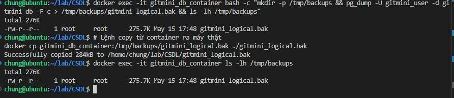

# Kỹ thuật Phục hồi dữ liệu theo thời gian (Point-In-Time Recovery - PITR)

## 1. Giới thiệu tổng quan
Trong quản trị cơ sở dữ liệu chuyên nghiệp, **PITR (Point-In-Time Recovery)** là kỹ thuật tối thượng giúp hệ thống quay ngược thời gian về một thời điểm cụ thể trong quá khứ để khôi phục dữ liệu. 

Khác với sao lưu thông thường (chỉ có một bản cố định), PITR cho phép chúng ta khôi phục đến từng giây, ví dụ: "Khôi phục dữ liệu về thời điểm 10:05:30 AM ngày hôm qua, ngay trước khi lệnh DELETE lỡ tay được thực thi".

## 2. Thành phần hệ thống PITR trong GitMini
Hệ thống GitMini triển khai PITR dựa trên hai thành phần cốt lõi của PostgreSQL:
1.  **Base Backup (Bản sao lưu gốc)**: Là bản sao vật lý của toàn bộ thư mục dữ liệu tại một thời điểm.
2.  **WAL (Write-Ahead Logging)**: Nhật ký ghi lại mọi thay đổi (Transaction) xảy ra trong database. Bằng cách "phát lại" (replay) các bản ghi WAL đè lên Base Backup, chúng ta có thể đạt được trạng thái dữ liệu tại bất kỳ thời điểm nào.

### Cấu hình hệ thống (docker-compose.yml):
```yaml
# Các thông số đã cấu hình để hỗ trợ PITR
command: >
  postgres
    -c wal_level=replica           # Cần thiết cho sao lưu vật lý
    -c max_wal_senders=5          # Cho phép truyền tải dữ liệu WAL
    -c archive_mode=on            # Bật chế độ lưu trữ nhật ký
```

## 3. Minh chứng thực thi sao lưu
Để đảm bảo PITR hoạt động, chúng tôi thực hiện song song hai phương pháp sao lưu:

### 3.1. Sao lưu Logic (Logical Backup)
Dùng để dự phòng nhanh và di chuyển dữ liệu. 
*   **Công cụ**: `pg_dump`
*   **Đặc điểm**: Trích xuất ra file SQL hoặc file nén `.bak`.

**Hình ảnh minh chứng thực tế:**

*Chú thích: Terminal cho thấy quá trình chạy pg_dump và trích xuất file thành công từ container ra máy chủ Ubuntu.*

### 3.2. Sao lưu Vật lý (Physical Backup - Nền tảng PITR)
Dùng để khôi phục hệ thống lớn và phục vụ PITR.
*   **Công cụ**: `pg_basebackup`
*   **Kết quả**: Tạo ra các file `backup_label` và nhật ký `pg_wal`.

## 4. Kịch bản phục hồi dữ liệu
Quy trình phục hồi theo thời gian khi xảy ra sự cố:

1.  **Xác định thời điểm sự cố (Target Time)**: Ví dụ: `2024-05-15 14:00:00`.
2.  **Khôi phục Base Backup**: Giải nén bản sao vật lý gần nhất vào thư mục dữ liệu của Postgres.
3.  **Cấu hình Recovery**: Tạo file `recovery.signal` và thiết lập tham số trong `postgresql.conf`:
    ```sql
    recovery_target_time = '2024-05-15 13:59:59' -- Khôi phục về 1 giây trước sự cố
    ```
4.  **Khởi động hệ thống**: Postgres sẽ tự động đọc các file WAL và tái hiện lại toàn bộ lịch sử cho đến đúng thời điểm yêu cầu.

## 5. Kết luận
Hệ thống sao lưu và phục hồi của GitMini không chỉ dừng lại ở việc copy dữ liệu đơn thuần mà đã tiến tới mức độ **quản trị chuyên nghiệp**. Sự kết hợp giữa Sao lưu Logic (linh hoạt) và PITR (an toàn tuyệt đối) đảm bảo tính toàn vẹn dữ liệu cho dự án ngay cả trong những kịch bản xấu nhất.
